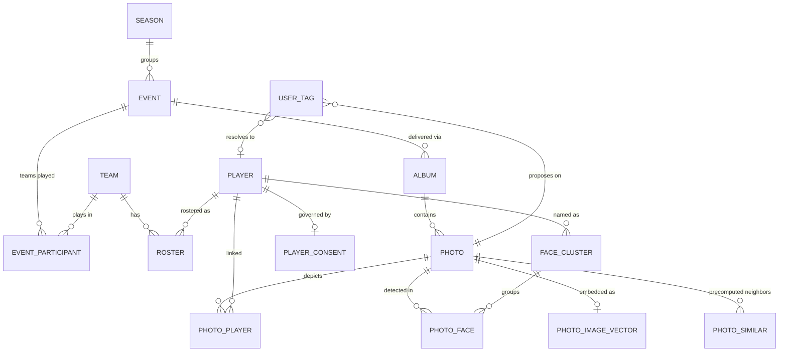

# North-Star Design — Nino Chavez Sports-Photography Platform

**Status:** Build contract. Supersedes the six subsystem drafts and folds in all four adversarial critiques.
**Stack:** SvelteKit 2 + Svelte 5 + Tailwind 4 + Supabase (Postgres + pgvector + Auth) + Cloudflare (Pages git-integration deploy, Cloudflare Images delivery, R2, album-zip Worker). **Not Vercel.**
**Scale:** ~21,128 photos, ~260 albums, growing; ~73% volleyball but genuinely multi-sport + non-sport shoots.

---

## 0. LOCKED CONTRACTS (read this first; every section below cites it, none re-declares it)

The single most damaging failure across the six drafts was contract drift — the same load-bearing value (an embedding dimension, a column type, a delimiter) declared differently in different sections. This table is the one source of truth. Any DDL, RPC, or TS const that contradicts it is wrong.

| Contract | Locked value | Why / disqualifier |
|---|---|---|
| **Identity vocabulary** | `players`, `teams`, `photo_players`, `photo_faces`, `face_clusters`, `rosters` | Matches SPEC.md/TASKS.md ground truth and the existing `user_tags.athlete_name → players` path. The `athlete/photo_athlete/roster_entry` vocabulary is **deleted**. |
| **Text (caption) embedding** | `vector(768)`, `openai/text-embedding-3-large` @ 768 (Matryoshka), via OpenRouter | Matches the live `embedding` column + HNSW; no migration. One `embedText()` for write AND query. |
| **Image embedding** | `vector(768)`, OpenCLIP **ViT-L/14** (projection dim = 768) | ViT-L/14 projection IS 768. The "1024 (ViT-L/14 dim)" claim conflated ViT-L with ViT-H — corrected. Uniform with caption space → one RPC shape. If SigLIP-large (1152) is ever chosen, it is a single-const change (see Open Decision 1). |
| **Face embedding** | `vector(512)`, InsightFace `buffalo_l` (RetinaFace detect + ArcFace embed) | ArcFace native dim. A distinct space; never shares a column with the 768 spaces. |
| **`extraction_version`** | `text`, format `'<version>:<model>'` e.g. `'vnext-1:gemini-2.5-flash-lite'` | Matches the already-shipped column. The `smallint` variant is **deleted**. |
| **`jersey_number`** | `text` everywhere (column AND RPC param), `CHECK (~ '^[0-9]{1,3}[A-Z]?$')` | `'00' ≠ '0'`; leading zeros and `'7A'` are real. Int designs silently broke this. OCR's integer-ish read is cast to text at the write boundary. |
| **`cf_image_id` format** | `'<album_key>-<image_key>'` (**hyphen**), guarded by `UNIQUE` + `UNIQUE(content_hash)` — **no `LIKE` format CHECK** | Verified in `upload-local-to-cloudflare.ts:175`. A slash CHECK would reject all 21K live rows. `content_hash` uniqueness is the stronger, format-agnostic collision guard. |
| **pgvector `search_path`** | `SET search_path = public` (bare `public`, NOT `public, extensions`) | The shipped Phase-1 fix uses bare `public` and works; pgvector operators resolve in `public` in this project. `public, extensions` would re-introduce the silent-search-break if `extensions` is not a schema here. |
| **Vision model** | `google/gemini-2.5-flash-lite` (LOCKED — do not "upgrade") | Benchmark-best AND cheapest for this classification task. |
| **Physical decomposition** | **One** model: `photos` (clean wide core: KNOWN + EXIF inline + classification + quality + caption + text embedding) + split-out `photo_image_vectors`, `photo_faces`, identity tables. | Read-path speed at 21K–100K beats textbook normalization; the per-photo `photo_classification`/`photo_inference`/`photo_vectors` 6-table shred is **not built**. The `enforce_event_sport` trigger fires on `photos` equally well. |
| **Sport authority** | `albums.sport` (enum, NULL = non-sport). **No per-photo sport column exists.** Sport reaches consumers via `photos_read` view's join to `albums`. | The root-bug field is deleted; there is nothing for a biased prompt to populate. |
| **Provenance ledger** | One table: `ingest_runs`. The `extraction_runs` name is **deleted**. DB ledger is authoritative; `.temp/` checkpoint is a deletable resume cache. | One name, one schema. |
| **Pipeline entry points** | **Extend** the existing `scripts/run-pipeline.ts` + `scripts/process-new-album.ts` (already wired as `pnpm pipeline` / `pnpm process:album`). Do NOT create a third entry point. | The 5-prompt-zoo proliferation must not recur one layer down. |

**Taxonomy single-source rule:** every enum (sport, photo_category, play_phase, action_intensity, etc.) is generated from **one** `src/lib/ai/taxonomy.ts` that exports the canonical arrays. A CI test asserts the Postgres enum members, the JSON-schema `enum`, and the ajv schema are all equal to those arrays and fails on mismatch. This codegen-and-test is **slice zero** — the cheapest, highest-ROI piece, built before anything else (it is what prevents the prompt-zoo class of drift).

---

## 1. Executive Summary

**What we are building.** A sports-action photography platform whose real job is **people-finding and selling** — a parent/recruiter/player finding every photo of a specific athlete (by name, jersey, or face), and the photographer (Nino) culling, curating, and selling per athlete and per event. Search and identity are the product; aesthetic cataloging is secondary.

**The root insight (the thesis that shapes every table):** **separate what you KNOW from what you INFER.** The current system's core error is asking the vision model to *guess* facts that are deterministic from the shoot context. `sport`, `event`, `teams`, `date`, `venue` are KNOWN at capture and set deterministically at the event/album level — never guessed per photo. Only `caption`, `action`, `quality`, `players-in-frame`, and `faces` are legitimately INFERRED.

**The measured failure this fixes.** A per-photo `sport_type` prompt hard-coded "95% volleyball, default to volleyball." Unbiased re-detection (160 of ~260 albums) found **41 conflicts in two classes**: ~18 real-sport mislabels (tennis/soccer/football/basketball stored as volleyball, several 4/4 unanimous) and ~23 non-sport albums carrying a sport (a marriage proposal stored as volleyball). Identity is unqueryable: a singular `jersey_number` column + a JSONB `players[]` blob means "every photo of athlete X" cannot be a clean relational query.

**Three tiers, each with a different write authority and a different DB defense:**

| Tier | Source of truth | Written by | DB defense |
|---|---|---|---|
| **KNOWN** | shoot context / EXIF | album curation (human) + EXIF reader | NOT NULL + FK; **no AI write grant** |
| **INFERRED** | the vision model | one structured extraction call | enum + CHECK + provenance stamp; nullable until enriched |
| **DERIVED** | a formula over inferred columns | Postgres `GENERATED` / precompute job | declarative; cannot drift |

**Cost is not the constraint** (measured ~$15.76 one-time for 21K, ~$0.063 per new ~80-photo album). The binding constraints, in priority order, are: **(1) closing the live `exec_sql` PII hole, (2) a fail-closed face-consent default, (3) a vector retrieval kernel that doesn't defeat its own index, (4) human-in-the-loop naming throughput.** Correctness, durability, privacy, and maintainability win over cost everywhere.

**Sequencing (do not big-bang this).** The diagnosed problem is a few columns on one table; the proven fix is in-place additive evolution (Phase 1 already shipped that way). We ship in slices: **Slice 0** taxonomy codegen + SQL regression harness; **Slice 1** events/albums + authoritative `albums.sport` + sport-enforcement trigger (kills the measured corruption); **Slice 2** relational `photo_players` + jersey/name people-finding (delivers the JTBD without GPUs); **Slice 3** faces/clustering/consent (full subsystem, only after Slice 2 is in prod and the naming UI is real).

---

## 2. North-Star Principles

1. **KNOW vs INFER is the column-placement algorithm**, not a slogan. A field's tier dictates who may write it and whether the DB defends it. KNOWN fields are physically unreachable by the AI writer.
2. **The corruption-class field does not exist.** Per-photo `sport_type` is deleted, not deprecated. The vision JSON schema has no `sport` key. There is nothing to default.
3. **DB integrity at the DDL level.** Native enums + CHECK + FK throughout. The `'cross country'`/`'cross_country'` dupe and `'portrait'`-in-sport bleed become write-time errors.
4. **Provenance enables surgical re-runs.** `extraction_version` + `enriched_at` + `ingest_runs` end the blind-full-re-run era. A prompt fix re-runs only stale rows.
5. **Identity is relational, precision-first.** Canonical `players`/`teams`/`rosters`; a `photo_players` link table; a `status` enum that gates `confirmed`. **A false "that's your kid" is strictly worse than a miss** — public surfaces read only `confirmed`, consent-cleared links.
6. **Privacy is structural, not advisory.** Faces, image vectors, and consent are service-role-only; the public surface queries only a confirmed, consent-filtered projection. Face search is **fail-closed**: discoverable only with a signed waiver.
7. **One retrieval kernel, one embedder, one ranking formula.** Every consumer surface is a parameterization, never a new query path. The kernel branches on filter selectivity so it never defeats its own index.
8. **Lift-and-shift what's proven; rebuild only what's wrong.** CDN renditions, share tokens, EXIF, the 119 captioned rows, quality scores, the `embedText()` contract, the worker-pool backfill engine, `gallery_scope='lpo'` — all preserved.
9. **Minimum complexity for the task.** No 6-table shred where a clean wide table reads faster. No faces subsystem specced at full fidelity before jersey-based people-finding is validated in prod.
10. **Test the seams that silently broke before.** Every historical silent regression (search_path='', query≠write embedder, quality sorting on the wrong column) gets a standing CI regression test.

---

## 3. Domain Model

### 3.1 Entity overview

Two grouping concepts are split because the current system conflated them:
- **`event`** = the *shoot* and its KNOWN facts (sport, type, date, venue, which teams played). Identity and search reason over events.
- **`album`** = the *delivery container* (CDN, share token, zip, `gallery_scope='lpo'`). One event can produce multiple albums; the LPO sub-brand is an album property. `album.event_id` FK carries sport down to photos.



```
                       ┌──────────┐
                       │  season  │
                       └────┬─────┘
                            │
   ┌──────┐  N   M  ┌───────▼───────┐  1   N  ┌──────────┐  1   N  ┌────────┐
   │ team │◄────────┤     event     ├─────────►│  album   ├────────►│ photo  │
   └──┬───┘  event_ │ (KNOWN facts: │  album.  │(delivery:│ album.  │(KNOWN+ │
      │      partic.│ sport/type/   │ event_id │ scope,   │ key FK  │ EXIF + │
      │ 1          │ date/venue)    │          │ token)   │         │ INFER) │
      │ N           └───────────────┘          └──────────┘         └───┬────┘
   ┌──▼─────┐                                                  1 │  │ 1 │ 1
   │ roster │  jersey(text) ↔ player, per team per season    ┌──▼┐ ┌▼─┐ ┌▼──────────┐
   │        │◄─────────────────────────────────┐            │face││img│ │photo_player│
   └──┬─────┘                                   │ resolves   │    ││vec│ │ (THE link  │
      │ N                                       │            └─┬──┘└───┘ │  table)    │
      │ 1                                  ┌─────┴──────┐       │ N       └─────┬─────┘
   ┌──▼─────┐  named via face_cluster   ┌─▼────────────┐       │               │ N
   │ player │◄──────────────────────────┤ face_cluster │◄──────┘ (player_id    │
   │(canon) │  / roster / user_tag      │ (same-person │         resolved via   │
   └──┬─────┘                           │  grouping)   │         cluster OR     │
      │ 1                               └──────────────┘         roster)────────┘
      │ 1
   ┌──▼──────────┐
   │player_consent│ (waiver + two opt-out grains: face_search vs fully_hidden)
   └─────────────┘
```

### 3.2 Identity-resolution workflow (precision-first)

Two automated proposers feed one human-gated resolution. Both write `photo_players` rows as `proposed`; only a human — or, narrowly, agreement between *two independent* signals — promotes to `confirmed`. **Public people-finding surfaces filter `status='confirmed'`; the admin review queue reads `status='proposed'`.**

**Path A — jersey + roster (KNOWN-leaning).**
1. Vision extraction yields per-photo `{jersey_seen (text), team_color, bbox, confidence}` candidates. This proposes a jersey, nothing more.
2. The resolver scopes to the photo's event via `event_participant` → candidate teams → their `roster` rows for the event's season.
3. Match `jersey_seen` + `team_color` (against `team.color_primary/secondary`) → `roster` → `player_id`.
4. Write `photo_players(source='jersey_roster', status='proposed', confidence, jersey_seen)`.
5. **No jersey-OCR-alone auto-confirm.** Jersey OCR on a motion-blurred action frame is exactly where misreads happen (8↔3, 13↔18), and a complete roster makes a *wrong* read confidently resolve to the *wrong real athlete*. A jersey link reaches `confirmed` **only** when corroborated by an independent face-cluster link on the same athlete (Path C), or by human review. (Critique fix: this closes the one precision hole in the draft.)

**Path B — face cluster → named player (INFERRED).**
1. `photo_faces` detected + embedded (512-d ArcFace).
2. **Conservative, event-scoped** clustering (tight cosine threshold; HDBSCAN/agglomerative). Event-scoping shrinks the candidate space so a precision-biased threshold still yields usable clusters. The threshold prefers **over-splitting** (recoverable by human merge) to over-merging (ships a false identity).
3. A human **names a cluster once** (admin UI extending `user_tags`/`admin/tags`): picks/creates a `player`, sets `face_cluster.player_id`, `status='named'`.
4. Naming **propagates**: every face in the cluster → its photo gets `photo_players(source='face_cluster', status='confirmed', face_id)`. One human action confirms dozens of photos.
5. Faces attaching *later* to a named cluster (cosine ≤ tight threshold to centroid) propagate as `proposed`, never `confirmed` — they weren't seen by the human who named the cluster.

**Path C — corroboration auto-confirm (the only automated `confirmed`).** Jersey says player A AND face-cluster says player A for the same person-in-frame → two `proposed` rows, same `player_id`, different `source` → both auto-promote to `confirmed`. This is the strongest signal in the system and the *only* path to confirmed without a human.

**Conflict handling.**
- **Disagreement** (jersey says A, face says B, overlapping bbox): both stay `proposed`; flagged to the conflict queue; human adjudicates (`confirm` one, `reject` the other — `status='rejected'`, kept for audit, never deleted; the `(photo_id, player_id, source)` PK + `rejected` state means a re-run can't silently re-propose it).
- **Roster gap** (jersey OCR'd, no matching roster row): no `photo_players` row with NULL player is allowed (the FK is NOT NULL). The raw jersey lives on the photo's `players_raw` JSONB sighting and surfaces in the admin "unresolved jerseys" view, where naming it creates the `player` + `roster` row + link in one action.
- **Cluster merge** (two clusters are one player): set the loser's `player.merged_into`; repoint links to the survivor; audit preserved.

**Cross-event linkage (the season-wide "every photo of X").** Event-scoped clustering is correct for tractability but must be linked across events automatically or the human merge queue is unbounded. For each *named* cluster centroid, a periodic job runs an ANN probe against other events' *unnamed* cluster representatives and surfaces only high-cosine candidates to a bounded merge queue ("these 6 clusters are one person — confirm in one action"). Never all-pairs; never a global re-cluster. Centroids are maintained incrementally (store sum-vector + count; O(1) per face).

**The one irreducible manual step is naming** — turning an anonymous cluster or unresolved jersey into a canonical player. Everything else (detect, embed, cluster, propose, propagate, search) is automated. Naming throughput is a first-class design constraint (see §5.4 and Open Decision 5).

---

## 4. Physical Schema

Apply order is dependency-correct: enums → catalog (teams/events/albums) → photos + deferred cover FK → identity (players/rosters/photo_players) → vectors/faces/clusters → consent → collections → triggers → RPCs → RLS → matviews → security retirement.

### 4.1 Enums (generated from `taxonomy.ts`; junk is unrepresentable)

```sql
CREATE TYPE sport AS ENUM (
  'volleyball','basketball','soccer','softball','baseball','football',
  'track','cross_country','golf','tennis','bowling','pickleball'
);  -- NO 'other', NO 'portrait'. Non-sport => sport IS NULL.

CREATE TYPE shoot_kind AS ENUM (
  'game','match','tournament','practice','scrimmage','meet',          -- sport contexts
  'family_portrait','senior_portrait','graduation','engagement',
  'proposal','wedding','location','event','other'                     -- non-sport
);

CREATE TYPE photo_category AS ENUM (
  'action','celebration','portrait','team','candid','crowd','venue','detail','ceremony','other'
);  -- 'portrait' lives HERE; it can never bleed into sport.

CREATE TYPE action_intensity AS ENUM ('low','medium','high','peak');
CREATE TYPE play_phase AS ENUM (
  'serve','pass','set','attack','block','dig','rally',                -- volleyball
  'shot','pass_play','rebound','dribble','tackle','pitch','swing','sprint',  -- multi-sport
  'pregame','timeout','sideline','none'
);
CREATE TYPE emotion AS ENUM ('triumph','focus','determination','joy','tension','disappointment','neutral');
CREATE TYPE composition AS ENUM ('rule_of_thirds','centered','leading_lines','symmetry','negative_space','fill_frame');
CREATE TYPE time_of_day AS ENUM ('morning','midday','afternoon','golden_hour','dusk','night','indoor');
CREATE TYPE lighting AS ENUM ('natural','artificial','mixed','backlit','dramatic','flat','harsh');
CREATE TYPE color_temperature AS ENUM ('warm','neutral','cool');

CREATE TYPE visibility AS ENUM ('public','unlisted','private');
CREATE TYPE link_source AS ENUM ('jersey_roster','face_cluster','vision_players','manual','user_tag');
CREATE TYPE link_status AS ENUM ('proposed','confirmed','rejected');
CREATE TYPE consent_status AS ENUM ('waiver_signed','pending','revoked','unknown');
CREATE TYPE cluster_status AS ENUM ('unnamed','named','ignored');
CREATE TYPE tag_status AS ENUM ('pending','approved','rejected');
```

> **Evolvability note (critique fix):** sport, play_phase, and photo_category are GROWING vocabularies, and native `ALTER TYPE ADD VALUE` can't run in-txn pre-PG14 and forces a JSON-schema/ajv regen per new sport. We keep them as enums **but** the `taxonomy.ts` codegen makes "add lacrosse" a one-file change that regenerates enum + schema + validator together with a CI assertion. If operations show frequent vocabulary churn, Open Decision 2 promotes sport/play_phase to FK lookup tables (INSERT, no DDL). Operational enums (visibility/link_status/consent_status/tag_status) stay enums permanently — they are truly fixed.

### 4.2 Catalog (KNOWN) — teams, events, albums

```sql
CREATE TABLE teams (
  team_id        uuid PRIMARY KEY DEFAULT gen_random_uuid(),
  name           text NOT NULL,
  short_name     text,
  sport          sport,                              -- NULL = club/multi
  color_primary  text,                               -- hex; jersey-color search ground truth
  color_secondary text,
  level          text,                               -- 'varsity','jv','club-17u','college'
  created_at     timestamptz NOT NULL DEFAULT now(),
  UNIQUE (name, sport, level)
);

CREATE TABLE seasons (
  season_id uuid PRIMARY KEY DEFAULT gen_random_uuid(),
  name      text NOT NULL,                           -- '2024 Fall'
  sport     sport, year_start int, year_end int
);

CREATE TABLE events (
  event_id     uuid PRIMARY KEY DEFAULT gen_random_uuid(),
  slug         text UNIQUE NOT NULL,
  title        text NOT NULL,
  sport        sport,                                -- NULL for non-sport shoots
  kind         shoot_kind NOT NULL,
  event_date   date NOT NULL,
  date_end     date,
  venue_name   text, venue_city text, venue_state text,
  season_id    uuid REFERENCES seasons(season_id),
  created_at   timestamptz NOT NULL DEFAULT now(),
  updated_at   timestamptz NOT NULL DEFAULT now(),
  -- THE constraint that kills "proposal stored as volleyball":
  CONSTRAINT sport_requires_sport_kind CHECK (
    sport IS NULL OR kind IN ('game','match','tournament','practice','scrimmage','meet')
  ),
  CONSTRAINT end_after_start CHECK (date_end IS NULL OR date_end >= event_date)
);
CREATE INDEX idx_event_sport_date ON events(sport, event_date DESC);

CREATE TABLE event_participant (
  event_id uuid NOT NULL REFERENCES events(event_id) ON DELETE CASCADE,
  team_id  uuid NOT NULL REFERENCES teams(team_id),
  side     text,                                     -- 'home'|'away'|NULL
  PRIMARY KEY (event_id, team_id)
);

-- albums: migrated album_settings + event FK. share_token preserved byte-for-byte.
CREATE TABLE albums (
  album_key      text PRIMARY KEY,                   -- carried verbatim (e.g. 'TRoiyO')
  album_name     text NOT NULL,
  event_id       uuid NOT NULL REFERENCES events(event_id) ON DELETE RESTRICT,
  sport          sport,                              -- inherited mirror of event.sport (set at ingest, immutable)
  sport_source   text NOT NULL DEFAULT 'operator'
                 CHECK (sport_source IN ('operator','detection-unanimous','legacy-unconfirmed')),
  gallery_scope  text,                               -- 'lpo' — lift-and-shift
  visibility     visibility NOT NULL DEFAULT 'public',
  share_token    uuid NOT NULL UNIQUE,               -- live shared links depend on this
  cover_photo_id uuid,                               -- deferred FK below
  created_at     timestamptz NOT NULL DEFAULT now(),
  updated_at     timestamptz NOT NULL DEFAULT now()
);
CREATE INDEX idx_albums_event ON albums(event_id);
CREATE INDEX idx_albums_scope ON albums(gallery_scope) WHERE gallery_scope IS NOT NULL;
CREATE INDEX idx_albums_share_token ON albums(share_token);
```

> `albums.sport` is a **denormalized immutable mirror** of `events.sport`, set once at ingest when the album's event FK is known. This is deliberate (critique fix): it removes a 3-table join from the hottest write path (the `enforce_event_sport` trigger reads one already-set column instead of joining albums→events→photos per classification write). The authority remains `events.sport`; the mirror is recomputable.

### 4.3 Core photo row (KNOWN + EXIF + INFERRED inline)

EXIF stays inline (1:1, immutable, same ingest writer — a join buys nothing). Classification/quality/caption/text-embedding stay inline (read-path speed at 21K–100K; the wide-clean table is the chosen physical model). Only image vectors and faces split out (read-perf + privacy boundaries everyone agrees on).

```sql
CREATE TABLE photos (
  photo_id      uuid PRIMARY KEY DEFAULT gen_random_uuid(),
  image_key     text NOT NULL UNIQUE,               -- stable anchor, carried (e.g. 'TRoiyO-DSC_0042')
  album_key     text NOT NULL REFERENCES albums(album_key) ON DELETE CASCADE,
  cf_image_id   text NOT NULL UNIQUE,               -- '<album_key>-<image_key>' (hyphen). UNIQUE = collision-proof
  content_hash  bytea NOT NULL UNIQUE,              -- sha256(bytes) — idempotency key; kills aliasing

  -- KNOWN sport mirror (set at ingest from album.sport; AI has no write grant; trigger-enforced)
  sport         sport,

  -- KNOWN capture facts (EXIF, ingest-written, never AI)
  captured_at   timestamptz,
  uploaded_at   timestamptz NOT NULL DEFAULT now(),
  width int NOT NULL CHECK (width > 0),
  height int NOT NULL CHECK (height > 0),
  aspect_ratio  numeric GENERATED ALWAYS AS (width::numeric / NULLIF(height,0)) STORED,
  camera_make text, camera_model text, lens_model text,
  focal_length text, aperture text, shutter_speed text, iso int,
  latitude double precision, longitude double precision, location_name text,  -- PII-adjacent; never in public read view

  -- INFERRED classification (enum-defended)
  photo_category    photo_category,
  play_phase        play_phase,
  action_intensity  action_intensity,
  emotion           emotion,
  composition       composition,
  time_of_day       time_of_day,
  lighting          lighting,
  color_temperature color_temperature,

  -- INFERRED caption (universal search surface) + text embedding (inline)
  caption       text,
  caption_tsv   tsvector GENERATED ALWAYS AS (to_tsvector('english', coalesce(caption,''))) STORED,
  embedding     vector(768),                        -- openai/text-embedding-3-large @768 (caption-derived)

  -- INFERRED quality components + DERIVED blend (lift-and-shift weights)
  sharpness         numeric CHECK (sharpness         IS NULL OR sharpness         BETWEEN 0 AND 10),
  composition_score numeric CHECK (composition_score IS NULL OR composition_score BETWEEN 0 AND 10),
  exposure_accuracy numeric CHECK (exposure_accuracy IS NULL OR exposure_accuracy BETWEEN 0 AND 10),
  emotional_impact  numeric CHECK (emotional_impact  IS NULL OR emotional_impact  BETWEEN 0 AND 10),
  quality_score numeric GENERATED ALWAYS AS (
      coalesce(sharpness,0)*0.35 + coalesce(composition_score,0)*0.30
    + coalesce(emotional_impact,0)*0.25 + coalesce(exposure_accuracy,0)*0.10
  ) STORED,

  -- raw multi-player sighting blob (pre-resolution staging; resolved rows go to photo_players)
  players_raw   jsonb,

  -- PROVENANCE (the capability the current system lacks)
  extraction_version text,                          -- 'vnext-1:gemini-2.5-flash-lite'
  ingest_run_id      uuid REFERENCES ingest_runs(ingest_run_id),
  ai_provider        text, ai_model text, ai_cost numeric,
  extraction_confidence numeric CHECK (extraction_confidence IS NULL OR extraction_confidence BETWEEN 0 AND 1),
  enriched_at        timestamptz
);

ALTER TABLE albums ADD CONSTRAINT fk_albums_cover
  FOREIGN KEY (cover_photo_id) REFERENCES photos(photo_id) ON DELETE SET NULL;

-- HARD-RULE-matching partial indexes (planner uses an index that already excludes unprocessed rows)
CREATE INDEX idx_photos_album_quality ON photos(album_key, quality_score DESC NULLS LAST) WHERE sharpness IS NOT NULL;
CREATE INDEX idx_photos_sport_cat_quality ON photos(sport, photo_category, quality_score DESC NULLS LAST) WHERE sharpness IS NOT NULL;
CREATE INDEX idx_photos_captured ON photos(captured_at DESC NULLS LAST);
CREATE INDEX idx_photos_caption_tsv ON photos USING gin(caption_tsv);
CREATE INDEX idx_photos_extraction_version ON photos(extraction_version);
CREATE INDEX idx_photos_embedding_hnsw ON photos USING hnsw (embedding vector_cosine_ops) WITH (m=16, ef_construction=64);

-- sport reaches the read path WITHOUT a per-photo authority decision (it's the enforced mirror):
CREATE VIEW photos_read AS
  SELECT p.*, a.album_name, a.gallery_scope, a.visibility
  FROM photos p JOIN albums a USING (album_key);
```

> **Note:** `ai_confidence` (the dead field) is **not** carried. Targeted re-runs key on `extraction_version` (deterministic) + `enriched_at` — the two real re-run triggers. `extraction_confidence` *is* kept, but only because it has a concrete consumer: the review-queue `low_confidence` rule (§5.4). (Critique fix: a field is carried only if a real consumer exists.)

### 4.4 Identity (relational — replaces the JSONB blob)

```sql
CREATE TABLE players (
  player_id     uuid PRIMARY KEY DEFAULT gen_random_uuid(),
  full_name     text NOT NULL,
  display_name  text,                               -- 'A. Chavez' for public surfaces
  slug          text,
  primary_team_id uuid REFERENCES teams(team_id),
  created_at    timestamptz NOT NULL DEFAULT now(),
  created_by    text NOT NULL,                       -- admin who named them; AI never creates a player
  merged_into   uuid REFERENCES players(player_id)   -- soft-merge; never delete a link
);
CREATE UNIQUE INDEX idx_player_slug ON players(slug) WHERE merged_into IS NULL;
CREATE INDEX players_name_trgm ON players USING gin (display_name gin_trgm_ops);  -- chatbot name lookup

CREATE TABLE rosters (
  roster_id    uuid PRIMARY KEY DEFAULT gen_random_uuid(),
  team_id      uuid NOT NULL REFERENCES teams(team_id),
  season_id    uuid REFERENCES seasons(season_id),
  player_id    uuid NOT NULL REFERENCES players(player_id),
  jersey_number text NOT NULL CHECK (jersey_number ~ '^[0-9]{1,3}[A-Z]?$'),  -- TEXT: '00','7A'
  position     text,
  CONSTRAINT uniq_jersey_per_team_season UNIQUE (team_id, season_id, jersey_number)
);
CREATE INDEX idx_roster_team_season ON rosters(team_id, season_id);

-- THE link table. PK forces a non-null player_id (unresolved jerseys live on photos.players_raw).
CREATE TABLE photo_players (
  photo_id     uuid NOT NULL REFERENCES photos(photo_id) ON DELETE CASCADE,
  player_id    uuid NOT NULL REFERENCES players(player_id),
  source       link_source NOT NULL,
  status       link_status NOT NULL DEFAULT 'proposed',
  confidence   real,                                -- NULL for manual
  jersey_seen  text,                                -- the OCR that triggered this (text)
  face_id      uuid REFERENCES photo_faces(face_id),
  team_id      uuid REFERENCES teams(team_id),
  resolved_by  text, resolved_at timestamptz,
  created_at   timestamptz NOT NULL DEFAULT now(),
  PRIMARY KEY (photo_id, player_id, source)
);
CREATE INDEX idx_pp_player_confirmed ON photo_players(player_id) WHERE status = 'confirmed';
CREATE INDEX idx_pp_pending ON photo_players(status) WHERE status = 'proposed';

-- user_tags: lift-and-shift approval flow, FK-resolved to canonical players.
CREATE TABLE user_tags (
  id           uuid PRIMARY KEY DEFAULT gen_random_uuid(),
  photo_id     uuid NOT NULL REFERENCES photos(photo_id) ON DELETE CASCADE,
  player_id    uuid REFERENCES players(player_id),
  athlete_name text, jersey_number text,
  status       tag_status NOT NULL DEFAULT 'pending',
  submitted_by text, approved_by text, approved_at timestamptz,
  created_at   timestamptz NOT NULL DEFAULT now()
);
CREATE INDEX idx_ut_pending ON user_tags(photo_id) WHERE status = 'pending';
```

> The product-defining query — every confirmed, consent-cleared, quality-ranked photo of a player — is one indexed join:
> `SELECT p.* FROM photos p JOIN photo_players pp ON pp.photo_id=p.photo_id WHERE pp.player_id=$1 AND pp.status='confirmed' ORDER BY p.quality_score DESC;`

### 4.5 Vectors, faces, clusters, similar-neighbors (split out: privacy + read-perf)

```sql
-- IMAGE embedding (visual similarity). Separate table; never in a public payload.
CREATE TABLE photo_image_vectors (
  photo_id         uuid PRIMARY KEY REFERENCES photos(photo_id) ON DELETE CASCADE,
  image_embedding  vector(768),                      -- OpenCLIP ViT-L/14 (768)
  image_embed_model text,                            -- 'open_clip:ViT-L-14' — guards query≠write
  embedded_at      timestamptz
);
-- Built but kept OFF the hot path: visual "more like this" is precomputed (below).
CREATE INDEX idx_piv_image_hnsw ON photo_image_vectors USING hnsw (image_embedding vector_cosine_ops) WITH (m=16, ef_construction=64);

-- Precomputed visual neighbors: "more like this" with ZERO HNSW at view time.
CREATE TABLE photo_similar (
  photo_id    uuid NOT NULL REFERENCES photos(photo_id) ON DELETE CASCADE,
  neighbor_id uuid NOT NULL REFERENCES photos(photo_id) ON DELETE CASCADE,
  rank        int NOT NULL,
  similarity  real NOT NULL,
  PRIMARY KEY (photo_id, neighbor_id)
);
CREATE INDEX idx_photo_similar ON photo_similar(photo_id, rank);

-- FACES (PII; service-role-only). buffalo_l: RetinaFace bbox + ArcFace 512-d.
CREATE TABLE photo_faces (
  face_id          uuid PRIMARY KEY DEFAULT gen_random_uuid(),
  photo_id         uuid NOT NULL REFERENCES photos(photo_id) ON DELETE CASCADE,
  bbox             jsonb NOT NULL,                   -- {x,y,w,h} normalized 0..1
  det_score        real NOT NULL,
  embedding        vector(512) NOT NULL,             -- ArcFace
  cluster_id       uuid REFERENCES face_clusters(cluster_id),
  cluster_dist     real,
  player_id        uuid REFERENCES players(player_id),  -- NULL until cluster named
  detector_version text NOT NULL,                    -- 'insightface-buffalo_l-v1'
  created_at       timestamptz NOT NULL DEFAULT now()
);
CREATE INDEX idx_face_photo ON photo_faces(photo_id);
CREATE INDEX idx_face_cluster ON photo_faces(cluster_id);
CREATE INDEX idx_face_player ON photo_faces(player_id) WHERE player_id IS NOT NULL;
-- Lower m for the high-cardinality face index (≤1M rows at 100K photos): memory budget.
CREATE INDEX idx_face_embedding_hnsw ON photo_faces USING hnsw (embedding vector_cosine_ops) WITH (m=12, ef_construction=64);

CREATE TABLE face_clusters (
  cluster_id    uuid PRIMARY KEY DEFAULT gen_random_uuid(),
  player_id     uuid REFERENCES players(player_id),  -- NULL until named
  status        cluster_status NOT NULL DEFAULT 'unnamed',
  centroid_sum  vector(512),                          -- running sum (incremental centroid; never re-sum)
  member_count  int NOT NULL DEFAULT 0,
  rep_face_id   uuid REFERENCES photo_faces(face_id), -- best exemplar for naming UI
  scope_event_id uuid REFERENCES events(event_id),
  cohesion      real,
  named_by      text, named_at timestamptz,
  created_at    timestamptz NOT NULL DEFAULT now()
);
CREATE INDEX idx_cluster_status ON face_clusters(status);

-- CONSENT (PII; service-role-only). Fail-CLOSED for face search.
CREATE TABLE player_consent (
  player_id           uuid PRIMARY KEY REFERENCES players(player_id) ON DELETE CASCADE,
  status              consent_status NOT NULL DEFAULT 'unknown',
  waiver_ref          text,                           -- canonical letspepper waiver id/url
  face_search_opt_out boolean NOT NULL DEFAULT false, -- don't find me by FACE (jersey/name OK)
  fully_hidden        boolean NOT NULL DEFAULT false, -- suppress from ALL public surfaces
  -- materialized fail-closed gate (trigger-maintained from the columns above):
  face_search_eligible boolean NOT NULL DEFAULT false,
  updated_by          text, updated_at timestamptz NOT NULL DEFAULT now()
);
```

> **`face_search_eligible` is a materialized, trigger-maintained boolean** = `(status='waiver_signed' AND NOT face_search_opt_out AND NOT fully_hidden)`. It defaults `false`. The face-search RPC checks this single column, so the privacy decision is auditable and defense-in-depth behind the one DEFINER predicate. **A newly-named player with `unknown` consent is NOT face-searchable** — fail-closed (critique fix; the draft's `<> 'revoked'` denylist failed open for minors' biometric data).

### 4.6 Collections as data

```sql
CREATE TABLE collections (
  collection_id uuid PRIMARY KEY DEFAULT gen_random_uuid(),
  slug          text UNIQUE NOT NULL,
  title         text NOT NULL, narrative text,
  filter_def    jsonb NOT NULL,                      -- serialized PhotoQuery structured shape
  quality_floor numeric NOT NULL DEFAULT 0,
  sort_by       text NOT NULL DEFAULT 'quality',
  is_active     boolean NOT NULL DEFAULT true, display_order int NOT NULL DEFAULT 0
);
```
`filter_def` keys are validated app-side against the taxonomy enum names before compiling into a parameterized kernel call — no raw JSON reaches SQL.

### 4.7 Triggers — make KNOW-vs-INFER mechanical, not advisory

```sql
-- sport is set once at ingest from album.sport (cheap single-row read; no 3-table join).
-- AI re-extraction UPDATEs classification columns but MAY NOT change sport.
CREATE OR REPLACE FUNCTION enforce_photo_sport() RETURNS trigger
LANGUAGE plpgsql SET search_path = public AS $$
BEGIN
  IF TG_OP = 'INSERT' THEN
    SELECT a.sport INTO NEW.sport FROM albums a WHERE a.album_key = NEW.album_key;  -- mirror at ingest
  ELSE
    NEW.sport := OLD.sport;  -- immutable after ingest; model's guess (if any) discarded
  END IF;
  RETURN NEW;
END $$;
CREATE TRIGGER trg_enforce_photo_sport
  BEFORE INSERT OR UPDATE ON photos FOR EACH ROW EXECUTE FUNCTION enforce_photo_sport();

-- shoot_kind / event.sport are KNOWN: only service-role + admin form may write events.
-- No AI write grant on events/teams/albums (enforced by RLS §4.9). event_type gets the
-- same structural protection as sport (critique fix): it lives on a table the AI cannot write.

-- maintain the fail-closed face-search gate from consent columns
CREATE OR REPLACE FUNCTION maintain_face_eligible() RETURNS trigger
LANGUAGE plpgsql AS $$ BEGIN
  NEW.face_search_eligible :=
    (NEW.status = 'waiver_signed' AND NOT NEW.face_search_opt_out AND NOT NEW.fully_hidden);
  NEW.updated_at := now(); RETURN NEW;
END $$;
CREATE TRIGGER trg_face_eligible BEFORE INSERT OR UPDATE ON player_consent
  FOR EACH ROW EXECUTE FUNCTION maintain_face_eligible();

CREATE OR REPLACE FUNCTION touch_updated_at() RETURNS trigger
LANGUAGE plpgsql AS $$ BEGIN NEW.updated_at := now(); RETURN NEW; END $$;
CREATE TRIGGER trg_albums_touch BEFORE UPDATE ON albums FOR EACH ROW EXECUTE FUNCTION touch_updated_at();
```

### 4.8 RPCs (search_path = public; one named vector column each; selectivity-branched)

See §7 for the full retrieval kernel. The face RPC and its fail-closed filter:

```sql
-- FACE search: 512-d ArcFace. SECURITY DEFINER (the one sanctioned hole through faces RLS),
-- fail-CLOSED via the materialized eligibility gate. Never returns the embedding.
CREATE OR REPLACE FUNCTION find_photos_by_face(
  p_query_embedding vector(512),
  p_match_threshold numeric DEFAULT 0.45,
  p_limit int DEFAULT 50
) RETURNS TABLE (photo_id uuid, face_id uuid, player_id uuid, face_bbox jsonb, similarity double precision)
LANGUAGE sql STABLE SECURITY DEFINER SET search_path = public AS $$
  SELECT f.photo_id, f.face_id, f.player_id, f.bbox,
         (1 - (f.embedding <=> p_query_embedding))::double precision
  FROM photo_faces f
  JOIN player_consent c ON c.player_id = f.player_id      -- INNER: no eligibility row => not returned
  WHERE f.embedding IS NOT NULL
    AND c.face_search_eligible = true                      -- positive allowlist, fail-closed
    AND (1 - (f.embedding <=> p_query_embedding)) >= p_match_threshold
  ORDER BY f.embedding <=> p_query_embedding LIMIT p_limit;
$$;
-- NOT granted to anon; called only through a service-role API route.
```

### 4.9 RLS (public reads published; faces/vectors/consent service-role-only)

```sql
ALTER TABLE photos ENABLE ROW LEVEL SECURITY;
ALTER TABLE albums ENABLE ROW LEVEL SECURITY;
ALTER TABLE events ENABLE ROW LEVEL SECURITY;
ALTER TABLE teams  ENABLE ROW LEVEL SECURITY;
ALTER TABLE players ENABLE ROW LEVEL SECURITY;
ALTER TABLE photo_players ENABLE ROW LEVEL SECURITY;
ALTER TABLE user_tags ENABLE ROW LEVEL SECURITY;

CREATE POLICY albums_read ON albums FOR SELECT TO anon, authenticated
  USING (visibility IN ('public','unlisted'));
CREATE POLICY photos_read ON photos FOR SELECT TO anon, authenticated
  USING (EXISTS (SELECT 1 FROM albums a WHERE a.album_key = photos.album_key
                 AND a.visibility IN ('public','unlisted')));
-- players: only confirmed-public, non-revoked, non-hidden are name-searchable
CREATE POLICY players_read ON players FOR SELECT TO anon, authenticated
  USING (merged_into IS NULL AND EXISTS (
    SELECT 1 FROM player_consent c WHERE c.player_id = players.player_id
    AND NOT c.fully_hidden AND c.status <> 'revoked'));
-- photo_players: only confirmed links to non-hidden players reach the public
CREATE POLICY pp_read ON photo_players FOR SELECT TO anon, authenticated
  USING (status = 'confirmed' AND EXISTS (
    SELECT 1 FROM player_consent c WHERE c.player_id = photo_players.player_id
    AND NOT c.fully_hidden AND c.status <> 'revoked'));
CREATE POLICY ut_read ON user_tags FOR SELECT TO anon, authenticated USING (status = 'approved');

-- PII tables: RLS enabled, ZERO select policies => default-deny for anon/authenticated.
-- Only service_role (bypasses RLS) and the SECURITY DEFINER face RPC reach them.
ALTER TABLE photo_faces ENABLE ROW LEVEL SECURITY;
ALTER TABLE face_clusters ENABLE ROW LEVEL SECURITY;
ALTER TABLE player_consent ENABLE ROW LEVEL SECURITY;
ALTER TABLE photo_image_vectors ENABLE ROW LEVEL SECURITY;
ALTER TABLE rosters ENABLE ROW LEVEL SECURITY;
```

### 4.10 Security retirement — close the live `exec_sql` hole (CRITICAL, Wave 0)

`public.exec_sql(text)` is live, `SECURITY DEFINER`, granted to `anon` AND `authenticated`, called from the browser anon client, guarded only by a bypassable regex denylist. A CTE/subquery starting with `select` reads straight through every PII table the identity design protects. Killing the *caller* in app code does **not** drop the function or revoke the grant.

```sql
-- Wave 0, before anything else:
REVOKE EXECUTE ON FUNCTION public.exec_sql(text) FROM anon, authenticated, PUBLIC;
-- after the kernel RPC replaces its two callers (server.ts timeline distributions, client.ts:91):
DROP FUNCTION IF EXISTS public.exec_sql(text);
```
**Standing CI gate:** assert zero `anon`/`authenticated` EXECUTE grants on any `SECURITY DEFINER` function except the explicitly-sanctioned `find_photos_by_face` (which is service-role-only anyway). This is not a one-time cleanup — it is a permanent check.

### 4.11 Materialized views

```sql
CREATE MATERIALIZED VIEW albums_summary AS
SELECT a.album_key, a.album_name, e.sport, e.kind, e.event_date,
       count(p.photo_id) AS photo_count, a.cover_photo_id,
       avg(p.quality_score) AS avg_quality, max(p.uploaded_at) AS last_upload
FROM albums a JOIN events e ON e.event_id = a.event_id
LEFT JOIN photos p ON p.album_key = a.album_key
GROUP BY a.album_key, a.album_name, e.sport, e.kind, e.event_date, a.cover_photo_id;
CREATE UNIQUE INDEX ON albums_summary(album_key);  -- enables REFRESH CONCURRENTLY

-- timeline_months_mv: lift-and-shift, off photos.captured_at.
```
> **`player_summary` is a plain indexed VIEW, not an MV** (critique fix). The per-player aggregate is cheap with `idx_pp_player_confirmed`; an MV joining players × photo_players × photos × albums × events at 100K would be a multi-second CONCURRENT refresh competing with viewers. The "browse all athletes" listing tolerates a paginated `GROUP BY` over the partial index. `albums_summary` refreshes per-touched-album (targeted upsert), not a full CONCURRENT rebuild on every ingest.

---

## 5. Extraction & Ingestion Pipeline

One idempotent path, four stages, **extending** `scripts/run-pipeline.ts` + `scripts/process-new-album.ts` (not a new entry point). The current three-script EXIF round-trip (`enrich-local-photos` → `sync-local-to-supabase` → `upload-local-to-cloudflare`) and the `sync-local-to-supabase.ts:120-176` regex keyword parsing are **deleted** — metadata writes directly to typed columns, never through EXIF keywords.

```
┌────────────┐  ┌────────────┐  ┌────────────────┐  ┌──────────────┐
│ 1. INGEST  │─▶│ 2. UPLOAD  │─▶│ 3. EXTRACT     │─▶│ 4. EMBED +   │
│ (KNOWN)    │  │ (CDN)      │  │ (INFER, AI)    │  │    LINK      │
└────────────┘  └────────────┘  └────────────────┘  └──────────────┘
 event facts     CF Images,      ONE schema-         caption→768 vec
 content_hash    hyphen id,      validated JSON      + jersey/roster
 row insert      content_hash    extraction/photo    resolve. Faces/img
                 5409 guard                          vec = batch (Slice 3)
       └──────────── ingest_runs (one row per batch, provenance) ──────────┘
```

### 5.1 Stage 1 — INGEST (capture what you KNOW)

A shoot = a directory of JPEGs + an event manifest the operator fills once (or a thin admin form). The manifest is the single place deterministic facts enter:

```jsonc
{
  "album_key": "TRoiyO",
  "album_name": "ACC vs ICCP",
  "event": {
    "sport": "tennis",            // KNOWN — operator-set, NOT model-guessed
    "kind": "match",
    "event_date": "2026-05-30",
    "venue_name": "Aurora Central Catholic",
    "teams": [ {"name":"Aurora Central Catholic","color_primary":"navy"},
               {"name":"Illinois Christian","color_primary":"red"} ]
  },
  "gallery_scope": null
}
```

Resolve `teams[]` → canonical `team_id`s (dedup by normalized name + sport); write `events`, `event_participant`, upsert `albums` (set `albums.sport` from the manifest, `sport_source='operator'`); walk the directory. Per JPEG: `content_hash = sha256(bytes)` (the idempotency key — filenames collide across cards, bytes don't); `image_key = ${album_key}-${basename}`; one read-only `exiftool -json` call. Insert with `ON CONFLICT (content_hash) DO NOTHING` — re-running ingest is a no-op.

### 5.2 Stage 2 — UPLOAD (lift-and-shift, hyphen id)

Lift `uploadFileToCF()` verbatim — the 429/`retry-after`/5xx backoff stays. `cf_image_id = ${album_key}-${image_key}` (hyphen, computed once in Stage 1). Keep the **5409 "refuse to auto-link"** guard, made deterministic: on a CF id-exists conflict, verify byte-identity (existing CF image hash vs our `content_hash`) — match → link, mismatch → fail loud into review. Vision (Stage 3) fetches the `large` (1600px) CF variant; the pipeline never needs local files again.

### 5.3 Stage 3 — EXTRACT (ONE structured, schema-validated call)

Replace the 5-prompt zoo (`buildCombinedPrompt`, `buildCaptionPrompt`, `AGENTIC_VISION_PROMPT`, `ENHANCED_AGENTIC_PROMPT`, `SPORT_VERIFICATION_PROMPT`, the `PORTFOLIO_CONTEXT` volleyball bias) with **one** `buildExtractionPrompt(ctx)` + provider-enforced structured output. The album's KNOWN sport is injected as **context, not instruction**: *"This photo is from a tennis match. Team colors: navy, red. Describe the action, quality, and visible players for SEARCH (include jersey numbers + colors). Do NOT classify the sport — it is known."*

The JSON schema has **no `sport` key** (the field cannot be emitted) but has a write-only `sport_contradiction` payload (`{detected, evidence, confidence}`) that catches genuine misfiles. **The contradiction payload is write-only to the review queue; it can NEVER write back to `events.sport`, `albums.sport`, or `photos.sport`** except via an operator-confirmed re-ingest with a corrected manifest (critique fix: the loop is provably closed).

```ts
// src/lib/ai/extraction.ts
export const EXTRACTION_VERSION = 'vnext-1';                    // bump to invalidate stale rows
export const VISION_MODEL = 'google/gemini-2.5-flash-lite';    // LOCKED
// response_format: { type:'json_schema', json_schema:{ name:'extraction', strict:true, schema: EXTRACTION_SCHEMA } }
```

Three guarantees stack: model constrained decoding (strict schema) → app-side `ajv` validation → Postgres enum/CHECK. A schema-invalid response is a transient failure (re-queue), never coerced. Writes: `photos.caption/classification/quality/players_raw/extraction_version/enriched_at`; resolved `photo_players` rows; enqueue review-queue rows per §5.4. Transport, `temperature:0`, `usage:{include:true}` lifted from `backfill-vnext.ts`. Add an OpenRouter `models[]` availability fallback (`gemini-2.0-flash-lite` → `qwen-2-vl-7b`) stamped with the actual model id; **fallback is availability insurance, not a quality upgrade**, re-runnable later under the canonical model.

### 5.4 Stage 4 — EMBED + LINK, and the review queue

- **Caption embedding:** `embedText(caption, OPENROUTER_API_KEY)` — unchanged, `openai/text-embedding-3-large` @768, the single write+query source of truth. Caption is never persisted without its embedding succeeding (the proven `caption IS NULL` = "not done" invariant). If `embedText()` returns null, caption is written, `embedding` stays null, row re-queued for embedding only; search degrades to full-text/structured for that row.
- **Jersey resolution (Slice 2):** parse `players_raw` → scope via `event_participant` → `rosters` → write `photo_players(source='jersey_roster', status='proposed')`.
- **Faces + image vectors (Slice 3, batch):** POST the `large` variant to self-hosted/hosted InsightFace `buffalo_l` → `photo_faces`; OpenCLIP ViT-L/14 → `photo_image_vectors`; precompute `photo_similar` top-12 at this time (so visual "more like this" is zero-HNSW at view time).

**Review queue** (the HITL bridge; reuses the `user_tags` approval shape):

```sql
CREATE TABLE review_queue (
  review_id   uuid PRIMARY KEY DEFAULT gen_random_uuid(),
  photo_id    uuid NOT NULL REFERENCES photos(photo_id) ON DELETE CASCADE,
  reason      text NOT NULL,    -- 'low_confidence'|'sport_contradiction'|'unnamed_cluster'|'jersey_no_player'|'conflict'
  payload     jsonb,
  status      text NOT NULL DEFAULT 'pending' CHECK (status IN ('pending','resolved','dismissed')),
  resolved_by text, resolved_at timestamptz, created_at timestamptz NOT NULL DEFAULT now()
);
CREATE INDEX idx_rq_pending ON review_queue(status) WHERE status = 'pending';
```

Enqueue rules: `extraction_confidence < 0.5` → low_confidence; `sport_contradiction.confidence > 0.7` → sport_contradiction (operator-confirmed re-ingest only); jersey with no roster match → jersey_no_player; (Slice 3) cluster ≥ N faces, no player → unnamed_cluster; Path-A/B disagreement → conflict.

**Naming throughput is a first-class affordance** (critique fix): bulk sport-confirm UI (4/4-unanimous detections default-accepted, eyes only on split votes); cross-event cluster pre-merge suggestions ("these 6 clusters are one person — one confirm"); roster-seeded auto-naming bootstrap (jersey + co-occurring face cluster → suggest the roster name); a dashboard surfacing `review_queue` depth + unnamed-cluster count so backlog is visible before it's unbounded.

### 5.5 Runtime model — idempotency, provenance, resumability

```sql
CREATE TABLE ingest_runs (
  ingest_run_id uuid PRIMARY KEY DEFAULT gen_random_uuid(),
  album_key text REFERENCES albums(album_key),   -- NULL for --all
  stage text NOT NULL,                            -- 'extract'|'embed'|'faces'
  extraction_version text NOT NULL, vision_model text,
  projected_rows int,                             -- stamped at START (runaway visible immediately)
  rows_total int, rows_ok int, rows_failed int, total_cost numeric,
  started_at timestamptz NOT NULL DEFAULT now(), finished_at timestamptz,
  status text NOT NULL DEFAULT 'running'          -- running|complete|partial|failed
);
```

**Idempotency = version-keyed selection** (the contract that ends blind re-runs):
```sql
SELECT p.photo_id, p.image_key, p.cf_image_id, p.sport, a.album_name
FROM photos p JOIN albums a ON a.album_key = p.album_key
WHERE p.cf_image_id IS NOT NULL
  AND (p.caption IS NULL OR p.extraction_version <> 'vnext-1:gemini-2.5-flash-lite' OR :overwrite)
  AND (:album_key IS NULL OR p.album_key = :album_key);
```
Bumping `EXTRACTION_VERSION` reprocesses exactly the stale rows. **Pre-flight cost guard** (critique fix): `--stage extract --all` first runs the selection COUNT and prints `"N rows, est. $X, est. Yh — proceed?"` (requires `--yes` non-interactively); a `--max-cost` cap aborts the worker pool when `totalCost` exceeds it. Lift the `backfill-vnext.ts` worker pool (concurrency 6), `processWithRetry` 429/5xx backoff (capped 30s), DB-state-driven resume (authoritative) + `.temp/` checkpoint (deletable convenience). CF upload concurrency 3.

At-ingest vs batch: caption + embedding + jersey sightings + inherited sport run **at-ingest** (a photo is searchable the instant they complete). Faces + image vectors + `photo_similar` + cross-event linkage run **batch** (their absence never blocks search).

---

## 6. AI Usage & Model Architecture

### 6.1 Seven tasks, three tiers

| # | Task | Model | When | Cost/photo | 21K backfill |
|---|---|---|---|---|---|
| 1 | Sport (album-level) | declared by operator; **unbiased sample-vote** only for unlabeled imports | once/album | $0.0009×5 (vote only) | ~$0.23 (votes) |
| 2 | Caption | Gemini 2.5 Flash Lite | at-ingest | folded into #4 | — |
| 3 | Players + jersey OCR | same call as #2/#4 | at-ingest | $0 marginal | — |
| 4 | Quality scoring | same call (full combined prompt) | at-ingest | $0.00073 combined | $15.42 |
| 5 | Faces (detect+embed) | InsightFace buffalo_l | batch | compute only | compute |
| 6 | Caption text embedding | text-embedding-3-large @768 | at-ingest | $0.0000052 | $0.11 |
| 7 | Image embedding | OpenCLIP ViT-L/14 @768 | batch | compute only | compute |

**Total measured one-time: ~$15.76. Per new ~80-photo album: ~$0.063.** Cost is recorded, not optimized.

### 6.2 Sport — bias made impossible by construction

- **Default path:** operator declares `albums.sport` at album creation (probability 1.0 — they were physically there). No model invoked for sport.
- **Fallback (unlabeled bulk imports only):** unbiased album-level **5-sample majority vote** (promote `album-sport-detect.ts` to a pipeline stage). Neutral prompt: *"Identify the primary sport from visible equipment/markings/actions. Be objective — do NOT assume any default. Use 'none' if NOT a sports photo."* ≥4/5 agree → set `albums.sport`, `sport_source='detection-unanimous'`; split or `'none'` → `albums.sport=NULL`, surface in review. This is the exact mechanism that found the 18 mislabels + 23 non-sport albums.

### 6.3 Provider strategy & failover

OpenRouter is the **sole hosted gateway** through one module boundary (`src/lib/ai/gateway.ts`); direct Google/OpenAI keys revoked (the revocation IS the enforcement against a second embedding model behind the project's back). Self-hosted/hosted faces + image embedding never route through OpenRouter (privacy + a separate concern).

- **Vision failover ladder:** in-process retry → OpenRouter `models[]` availability fallback (stamped) → hard-fail to queue (`enriched_at IS NULL`), **never a placeholder/guessed value**. A null row is recoverable; a guessed row is silent corruption — the structural opposite of "default to volleyball."
- **Embeddings have NO model fallback** (one model, one vector space; a different embedder returns confident noise). But embeddings are on the **synchronous query path** (critique fix), so: **(a)** a query-vector cache (Cloudflare KV/edge, TTL'd — recurring NL queries hit cache during a transient outage instead of returning a blank grid); **(b)** `embedText()` distinguishes 401/403 (page the operator — the revoked-key class) from 429/5xx (retry); **(c)** a synthetic uptime probe runs one canonical semantic query on a schedule and alerts on empty/degraded results; **(d)** when embeddings are down, free-text-only queries surface a "search temporarily limited" state, not an empty grid.

### 6.4 Bias prevention — four independent structural barriers

1. **The field doesn't exist** — no per-photo `sport` column; no `sport` key in the vision schema.
2. **Sport is KNOWN, declared at album level** — the default path never asks a model.
3. **When a model IS used (unlabeled), zero default** — `'none'` is first-class; low confidence → review.
4. **Enum + JSON-schema enum + ajv** — a hallucinated illegal value is unwritable; other enums can't accrete dupes either.

The `PORTFOLIO_CONTEXT` constant and every "default to volleyball" string in `enrichment-prompts.ts` are **deleted, not edited**. `event_type`/`shoot_kind` gets the same protection as sport: it lives on `events`, which has no AI write grant (critique fix — the draft left it as an unprotected column).

---

## 7. Search, Retrieval & Consumer API

One retrieval kernel, one TS module, one projection, one embedder, one ranking formula. Consumers are thin projections in `+page.server.ts` load functions (no self-fetch; service_role client server-side only). **The kernel branches on filter selectivity so it never defeats its own index** — the single most important correction from the draft.

### 7.1 The retrieval contract (TS-orchestrated, two SQL strategies)

```ts
// $lib/server/retrieval.ts — SERVER ONLY
export interface PhotoQuery {
  text?: string;            // NL → embedText → vector
  imageKey?: string;        // "more like this" → photo_similar lookup (precomputed, no HNSW)
  // structured filters (all optional)
  sport?: string; category?: string; playPhases?: string[]; actionIntensity?: string[];
  lighting?: string[]; colorTemp?: string[]; timeOfDay?: string[]; composition?: string[];
  emotion?: string; albumKey?: string; eventId?: string; teamId?: string;
  playerId?: string; jerseyNumber?: string; qualityFloor?: number; galleryScope?: 'lpo';
  sort?: 'relevance'|'quality'|'newest'|'oldest'|'intensity';
  matchThreshold?: number; limit?: number; offset?: number;
}
export async function searchPhotos(q: PhotoQuery, platform): Promise<SearchResponse>;
```

**The selectivity branch (critique fix — defeats both the `COUNT(*) OVER()` index-kill AND filtered-ANN recall collapse):**

- **Broad semantic** (text vector, no selective filter): call `search_photos_ann` — pure `ORDER BY embedding <=> q LIMIT k` with `SET LOCAL hnsw.ef_search` (plpgsql), **NO window count**. HNSW early-stops. `hasMore = rows.length === limit`. No exact `total_count` on the vector path.
- **Selective filtered** (text vector + `playerId`/`jerseyNumber`/`albumKey`/`qualityFloor≥9`): call `search_photos_exact` — pre-filter to the bounded candidate set via B-tree/identity indexes, then **exact-scan `<=>`** over that set (≤2–5K rows is sub-50ms with perfect recall). This is the highest-value JTBD query ("semantic search within this athlete's photos") and HNSW post-filtering handles it *worst* — exact scan is correct here.
- **Pure structured** (no vector): B-tree path with **keyset pagination** on `(quality_score DESC, photo_id DESC)` (the deterministic tiebreak makes it trivial). `total_count` computed **once per filter-combination and cached** (KV/edge), never `COUNT(*) OVER()` per page, never `OFFSET 480` deep-scan.

```sql
-- broad semantic: index-friendly, count-free (plpgsql for SET LOCAL ef_search)
CREATE OR REPLACE FUNCTION search_photos_ann(
  p_embedding vector(768), p_threshold double precision DEFAULT 0.25,
  p_sport sport DEFAULT NULL, p_limit int DEFAULT 24, p_ef_search int DEFAULT 80
) RETURNS TABLE (/* PHOTO_RESULT projection + similarity */)
LANGUAGE plpgsql STABLE SECURITY INVOKER SET search_path = public AS $$
BEGIN
  PERFORM set_config('hnsw.ef_search', p_ef_search::text, true);  -- per-call recall/latency knob
  RETURN QUERY
    SELECT /* projection */, (1 - (p.embedding <=> p_embedding))::double precision AS similarity
    FROM photos p JOIN albums a USING (album_key)
    WHERE p.sharpness IS NOT NULL AND a.visibility = 'public'
      AND (p_sport IS NULL OR p.sport = p_sport)
      AND (1 - (p.embedding <=> p_embedding)) >= p_threshold
    ORDER BY p.embedding <=> p_embedding LIMIT p_limit;
END $$;
GRANT EXECUTE ON FUNCTION search_photos_ann TO anon, authenticated;
```

**Ranking:** `quality_score` (GENERATED 0.35/0.30/0.25/0.10) is the spine. With a vector present, `rank_score = similarity*0.85 + (quality_score/10)*0.15` (quality nudges equally-similar frames toward the sharper one). Pure structured falls back to the requested sort. **The hard rule `sharpness IS NOT NULL` lives in the kernel**, not each consumer, matched by the partial indexes. `embedText()` is the only embedder; `transformPhotoRow` (CF variant URLs) is reused verbatim. The NLP parser is demoted to a pre-filter hint extractor (pulls "#12", "golden hour" into structured params; remaining free text is always embedded — removes the brittle "all terms matched → skip semantic" gate).

### 7.2 Identity browse (the actual product)

- `find_player_photos(player_id, sort, limit, offset)` — unions `photo_players` (confirmed) + named face-cluster matches, dedupes to one row/photo carrying the strongest `match_source` (face_cluster > user_tag > jersey_roster > vision_players) so the UI can badge "matched by face" vs "jersey #12" (the trust signal a parent needs before buying).
- `find_photos_by_jersey(p_jersey text, p_event_id, p_team_id, limit, offset)` — **scoped** by event/team because `#12` is unique only within a team at an event. Pure relational over `photo_players`. (Param is `text`, matching the TEXT jersey lock.)
- `find_photos_by_face` — §4.8, fail-closed, DEFINER, never returns the embedding. Two seeds: click a face → `face_id`; or upload a selfie embedded server-side.
- `listPlayersForEvent(event_id)` — roster strip for the album/event page ("jump to a player").

### 7.3 Per-consumer surfaces (all thin projections)

`/explore` — `searchPhotos(q)` + cached filter counts; `total_count` from the cached per-filter count (structured) or `hasMore` (semantic). `/` — `searchPhotos({qualityFloor:8.5, sort:'quality', limit:5})` (no volleyball hardcode — the library is multi-sport). `/api/chat` (Shot Bot) — tool maps to one kernel call; adds `findPlayer` (name → `player_id` via trigram) so "show me photos of Ava" resolves. `/photo/[id]` — `photo_similar` lookup (precomputed; zero HNSW), `find_player_photos`-lite per tagged player, approved `user_tags`; faces via a DEFINER view returning bbox + public name only. `/collections/[slug]` — `searchPhotos({...collection.filter_def})` (collections as data). `/timeline` — `timeline_months_mv` + per-period kernel calls (the `exec_sql` string-building is deleted). `/albums/[slug]` — `searchPhotos({albumKey})` + `listPlayersForEvent` (the album page becomes a people-finder).

### 7.4 `match_photos` compatibility & operational hardening

Keep the shipped `match_photos(vector, double precision, integer)` as a **thin shim delegating to `search_photos_ann`** for the duration of the compatibility-view window, then drop both in the final contract migration — the shipped Phase-1 RPC is never left stranded. All vector RPCs use `SET search_path = public` (bare). Confirm Supavisor/PgBouncer **transaction-mode** pooling (port 6543) for the SvelteKit edge functions; set an aggressive `statement_timeout` so a pathological query can't hold a connection; per-album public pages are `setHeaders`-cacheable at the Cloudflare edge so a tournament-drop spike on one album is served largely from CDN, not Postgres. The 30-min distribution cache moves from per-isolate in-memory (near-zero hit rate on Cloudflare isolates) to **Cloudflare KV / a cron-refreshed MV** (critique fix).

---

## 8. Migration & Cutover Roadmap

**Shape:** in-place expand → backfill → contract on the **existing** Supabase project, NOT a parallel DB. *Canonical = blue-green parallel DB; disqualified because `cf_image_id` and `share_token` are foreign keys into Cloudflare Images and shared-link state we can't cheaply re-mint; chosen alternative = in-place expand/contract.* Every disposition keys off the stable `image_key` + `album_key`, so every external reference (CDN, share links, analytics FKs) stays valid throughout.

### 8.1 Per-data-class disposition (the salvage manifest)

| Data class | Live location | Disposition | How produced in rebuild |
|---|---|---|---|
| CDN renditions | Cloudflare Images (by `cf_image_id`) | **LIFT-AND-SHIFT** | Untouched. |
| `cf_image_id` | `photo_metadata.cf_image_id` | **LIFT + validate** | Carried; uniqueness gate (hyphen format). |
| EXIF | `photo_metadata.*` | **LIFT-AND-SHIFT** | Inline on `photos`. |
| `album_settings` + `gallery_scope` + `share_token` + `visibility` | `album_settings` | **LIFT-AND-SHIFT** | Becomes `albums` spine; tokens byte-for-byte. |
| 119 captioned TRoiyO rows | `photo_metadata` (current `extraction_version`) | **LIFT-AND-SHIFT** | Idempotency skip; full backfill skips them. |
| Quality scores | `photo_metadata.*` | **LIFT-AND-SHIFT** | `quality_score` recomputes as GENERATED. |
| **`sport_type`** | `photo_metadata.sport_type` | **DISCARD + RE-DERIVE at album level** | Operator-confirmed `albums.sport`; inherited via FK/trigger; **no per-photo column**. |
| `caption`/`embedding` (non-TRoiyO ~21,009) | `photo_metadata.*` | **RE-DERIVE** | Fresh caption pass + `embedText()` re-embed. |
| Classification | `photo_metadata.*` | **RE-DERIVE** | Same vision call, constrained by `albums.sport`. |
| Identity (`jersey_number`, `players[]`, `team_colors`) | `photo_metadata.*` | **RE-DERIVE → relational** | `photo_players` rows; faces net-new; `user_tags.athlete_name → players`. |
| `photo_category='portrait'` bleed (2,200) + sport-as-portrait | `photo_metadata` | **DISCARD** | Non-sport → `albums.sport=NULL` + `photo_category` from inference. |
| `sport_type='other'` (29) + `'portrait'` (2,200) rows | `photo_metadata` | **REWRITE before enum cast** | Rewrite to NULL + correct `photo_category` in Wave 1 (critique fix — else they're unhandled cast failures). |
| `ai_confidence`, phantom flags, normalization dupes | `photo_metadata` | **DISCARD** | Enums prevent re-entry. |
| **`photo_metadata.event_id`** (live `string\|null`) | `photo_metadata.event_id` | **PROMOTE then DISCARD** | Seed the album→event backfill (one event per distinct value, or per album if sparse); audit non-null count + consumers; then drop the per-photo column. (Critique fix — the draft left this real live column with no verb.) |
| `user_tags` | `user_tags` | **LIFT + bridge** | Add `player_id` FK; backfill from `athlete_name → players`. |
| Matviews | views | **REBUILD** (defs) | Redefined against new tables. |
| Analytics (`photo_views`, etc.), `lp_*` tables | tables | **LIFT-AND-SHIFT** | FK target `image_key` survives; untouched. |
| **`exec_sql(text)`** | `public.exec_sql` | **REVOKE + DROP** | Wave 0 security retirement (§4.10). |

### 8.2 Phased waves (each independently shippable; hard ordering: sport BEFORE captions)

```
WAVE 0  Expand + secure (additive, zero read-path change)
  ├─ Slice 0: taxonomy.ts codegen + SQL regression harness (pgTAP/tsx)
  ├─ REVOKE exec_sql FROM anon,authenticated,PUBLIC  ← CRITICAL, first
  ├─ Build: teams/events/event_participant/albums (sport NULL, source='legacy-unconfirmed')
  ├─ Build: photos shell, players/rosters/photo_players, photo_image_vectors,
  │         photo_faces/face_clusters/player_consent, photo_similar, review_queue, ingest_runs
  ├─ Build: enums + NOT VALID constraints + FKs + photos_read view + triggers
  ├─ Snapshot pre-backfill caption/embedding/sport_type of all 21K → photo_metadata_pre_vnext_snapshot
  └─ GATE 0: schema diff clean; existing site reads UNCHANGED; exec_sql ungrantcheck green

WAVE 1  Confirm sport (KNOWN gate — human-in-loop)  [Slice 1]
  ├─ Run album-sport-detect over the ~100 un-sampled albums (the 160-sample is NOT the library)
  ├─ Rewrite the 2,229 'other'/'portrait' sport_type rows → NULL + correct photo_category
  ├─ Operator 3-tier confirm: 4/4-unanimous auto-accept (spot-check), 2-3/4 mandatory review,
  │   no-conflict → spot-check; populate albums.sport + sport_source
  └─ GATE 1: ZERO albums at sport_source='legacy-unconfirmed'  ← BLOCKS Wave 2

WAVE 2  Backfill captions/embeddings/classification (INFERRED, sport-constrained)  [Slice 1→2]
  ├─ backfill-vnext over ~21,009 (skip 119 TRoiyO); pre-flight cost guard + --max-cost
  ├─ Writes caption/embedding/classification/players_raw; photo_players(jersey_roster, proposed)
  └─ GATE 2: 100% caption+embedding+extraction_version; cost within $12.18±; spot-check N=30/album

WAVE 3  Contract + cutover read path
  ├─ Flip READ_SCHEMA_VERSION=v2 (loaders → photos_read; one Pages git deploy)
  ├─ DROP exec_sql (callers now replaced); rebuild + refresh matviews
  ├─ VALIDATE CONSTRAINT valid_sport_type; validate cf_image_id uniqueness
  └─ GATE 3: full validation suite (§8.3) green on the preview deploy BEFORE prod

WAVE 4  Faces + visual (post-cutover, non-blocking)  [Slice 3]
  ├─ image_embedding (ViT-L/14) + photo_similar precompute + InsightFace pass
  ├─ cluster → name → players; cross-event linkage; player_consent waiver sync
  └─ Each ships independently; the site is already correct after Wave 3.
```

### 8.3 Validation gates (hard stops on the preview deploy before prod)

| Gate | Check | Pass |
|---|---|---|
| G-exec-sql | no anon/authenticated EXECUTE on any DEFINER fn except sanctioned | true |
| G-sport-coverage | `albums WHERE sport_source='legacy-unconfirmed'` | `=0` |
| G-no-category-bleed | `albums WHERE sport::text IN ('portrait','other')` | `=0` |
| G-cast-safety | no `photo_metadata.sport_type IN ('other','portrait')` remaining | `=0` |
| G-caption-coverage | `photos WHERE caption IS NULL` | `=0` |
| G-embedding-space | every `embedding` non-null 768-d; `extraction_version` set | 100% |
| G-vector-operator | `SELECT ('[1,0]'::vector <=> '[0,1]'::vector)` | returns a number (search_path guard) |
| G-cf-uniqueness | dup `cf_image_id` | `0 rows` |
| G-content-hash | dup `content_hash` | `0 rows` |
| G-fk-orphans | photos→albums, photo_players→photos/players, photo_faces→photos | `0` |
| G-share-tokens | `albums` token set == `album_settings` snapshot | identical |
| G-rowcount | `count(photos) == count(photo_metadata snapshot)` | exact |
| G-read-parity | 50 albums + 200 photos old-vs-new loaders | identical CDN URLs + sets |
| G-search-smoke | SPEC queries ("diving save near the sideline", jersey-color) | relevant, not empty |
| G-quality-sort | "Best Photos" order == `quality_score DESC` | matches GENERATED |
| G-face-fail-closed | insert `unknown`-consent player; `find_photos_by_face` for them | `0 rows` |

The cutover gates G-vector-operator, G-quality-sort, G-face-fail-closed are **promoted to standing CI**, not one-shot.

### 8.4 Rollback

| Failure | Rollback |
|---|---|
| Wave 0 expand | Additive only — DROP new objects; zero user impact. |
| Wave 1 sport | Data not structure — re-edit + re-run; `sport_source` audit shows changes. |
| Wave 2 backfill | `UPDATE photos SET caption=NULL, embedding=<snapshot> WHERE extraction_version='vnext-1:…'` from `photo_metadata_pre_vnext_snapshot`; re-run corrected. 119 TRoiyO protected by skip. |
| Wave 3 cutover | `git revert` the `READ_SCHEMA_VERSION` commit → Pages redeploys prior build in minutes. Compatibility view kept the old path alive. Keep view 2 weeks, then final contract migration (requires explicit operator sign-off — the only irreversible op). |
| Wave 4 faces | Isolated table, no public dependency — `TRUNCATE photo_faces` + re-run. |

---

## 9. What We Will NOT Repeat (anti-pattern → the rule that prevents it)

| Anti-pattern (measured) | The rule that makes it impossible |
|---|---|
| `sport_type` guessed per-photo, volleyball-biased | Sport is `events.sport` → `albums.sport` → `photos.sport` mirror, operator-set; no AI write grant; the vision schema has no sport key; CHECK forbids sport on non-sport `kind`. |
| Singular `jersey_number` + JSONB `players[]` | `photo_players` link table + canonical `players` + `rosters`; "every photo of X" is one indexed join. |
| No canonical athletes/teams/rosters | `players`, `teams`, `rosters`, `event_participant`. |
| No faces | `photo_faces` (RetinaFace+ArcFace 512) → `face_clusters` → named `player`. |
| 56-column conflation | One clean-wide `photos` (KNOWN+EXIF+classification+quality+caption+text vec inline) + split-out image vectors/faces/identity only where writer/privacy/cardinality differ. |
| No provenance | `extraction_version`, `enriched_at`, `ingest_runs`, `detector_version`, `link_status`, `resolved_by/at`. |
| No DB integrity | Enums + CHECK + FK throughout; jersey uniqueness per team/season. |
| EXIF-keyword round-trip (lossy) | Direct typed-column writes; the regex keyword parser is deleted. |
| Query embedder ≠ write embedder, revoked key | One `embedText()` for both paths; one model const; revoked direct keys; 401-vs-5xx handling + synthetic probe. |
| `search_path=''` hid `<=>` | All vector RPCs `SET search_path = public`; G-vector-operator standing CI test. |
| `cf_image_id` bare filename collision | `content_hash` UNIQUE idempotency + album-prefixed hyphen `cf_image_id` UNIQUE; 5409 byte-verify guard. |
| Quality sorted on the wrong column | `quality_score` GENERATED blend; G-quality-sort standing CI test. |
| **Live `exec_sql` granted to anon (PII hole)** | REVOKE + DROP at Wave 0; standing CI gate against anon DEFINER grants. |
| **Face search fail-open for minors** | Materialized `face_search_eligible` positive allowlist (`waiver_signed AND NOT opt_out AND NOT hidden`); default false; G-face-fail-closed test. |
| **`COUNT(*) OVER()` welded to HNSW order** | Count-free `search_photos_ann` on the vector path; keyset + cached counts on structured. |
| **Filtered-ANN recall collapse on athlete search** | Selectivity branch — exact-scan bounded identity sets; HNSW only for broad queries. |
| **5-prompt zoo drift** | One `buildExtractionPrompt` + one `taxonomy.ts` codegen + CI equality test across enum/schema/ajv. |
| Three competing schemas / dim contradictions in the spec | The §0 LOCKED CONTRACTS table; sections cite it, never re-declare. |
| Blind full re-runs | Version-keyed selection + pre-flight cost guard + `--max-cost`. |

---

## 10. Open Decisions for the Operator

1. **Image-embedding model variant — recommend OpenCLIP ViT-L/14 (768).** Locked at 768 for space-uniformity with captions and a single RPC shape. If SigLIP-large (1152) is preferred for visual recall, it is a one-const change (column + HNSW + RPC param all from one source), but cross-modal text→image then needs the SigLIP text encoder, not OpenCLIP's. **Recommendation: ViT-L/14 @768 unless a measured recall need justifies 1152.**

2. **Sport/play_phase as enums vs FK lookup tables — recommend enums + codegen now.** Native enums + the `taxonomy.ts` one-file codegen make "add lacrosse" cheap enough. If operations show frequent vocabulary churn (more than ~2 new sports/year requiring schema deploys), promote `sport` and `play_phase` to FK lookup tables (INSERT, zero DDL, per-sport play vocabulary). **Recommendation: enums now; revisit only on observed churn.**

3. **Faces — RESOLVED (operator, 2026-06-08): local InsightFace batch on the M3 Max.** The earlier "hosted" rec was wrong: it assumed faces are a *served* inference endpoint needing an always-on GPU box. They are not. Detection + embedding is **batch work at ingest**; serving is pure pgvector cosine inside Postgres (no GPU, no server, no second security surface, no non-Pages deploy). InsightFace `buffalo_l` runs locally via onnxruntime (CoreML/CPU) on the operator's M3 Max — one-time ~21K rebuild is an evening's batch; a new ~80-photo album is minutes; incremental clustering matches new faces against existing named-cluster centroids (a pgvector query, not a re-run). It fits the existing local-script ingest pattern, costs $0, and keeps face PII on the operator's machine (only embeddings reach the DB — a privacy gain). The face pipeline is a local batch script (sibling to enrich/backfill), NOT a deployed service. Hosted (Replicate/serverless) is the fallback only if the library outgrows local batch or ingest must leave the operator's machine.

4. **Cross-modal text→image — recommend defer to Slice 3+.** Caption-semantic (`embedText(query)` vs the 768 caption space) already answers most text→image intent in one consistent space. CLIP-text cross-modal (a second text encoder against `image_embedding`) doubles the query-path failure surface for marginal recall on purely-visual queries ("silhouette at sunset"). **Recommendation: defer; add `p_clip_text_embedding` only if visual-only queries prove a real gap.**

5. **HITL naming throughput / operator hours per album — needs an operator commitment.** The precision-first posture makes unnamed = publicly invisible, so the core JTBD is gated on Nino's manual naming/adjudication, which scales with library growth. The design supplies affordances (bulk sport-confirm, cross-event pre-merge, roster-seeded auto-naming, a backlog dashboard). **Recommendation: budget explicit hours/album and instrument the `review_queue` depth before Slice 3; if throughput is the bottleneck, prioritize roster-seeded auto-naming and corroboration auto-confirm to minimize manual actions.**

6. **`hnsw.ef_search` value — recommend benchmark before locking.** The kernel parameterizes it (40 broad explore, 200+ filtered) but the exact value must be measured against recall@k on a ground-truth fixture at 100K, not guessed. **Recommendation: ship the selectivity branch with `ef_search=80` default, then tune from a measured recall@k curve — the design costs everything else empirically; recall must be too.**

7. **Final contract migration (drop compatibility view + old `photo_metadata` columns) — requires explicit sign-off.** This is the one irreversible operation. **Recommendation: run only after 2 weeks of green prod on the new read path, as a separate operator-approved migration, never bundled into the cutover deploy.**